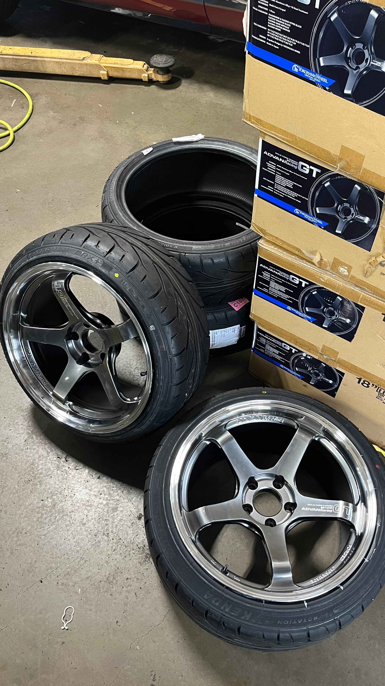
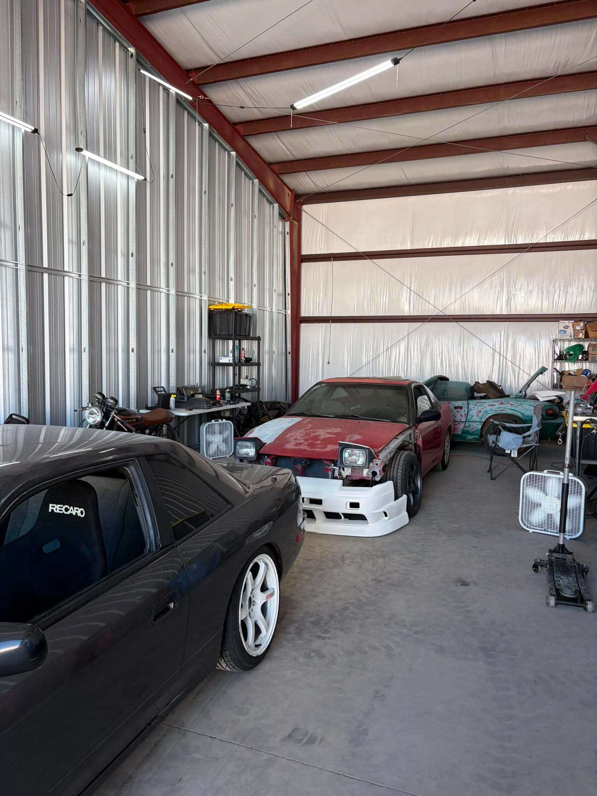
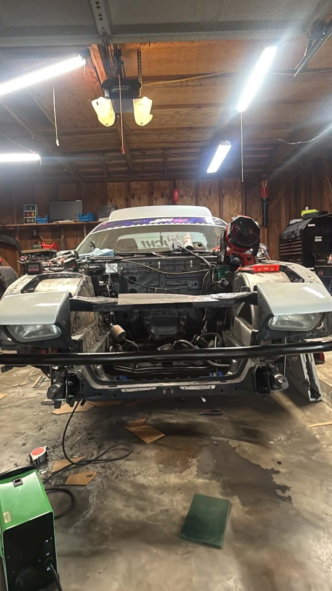
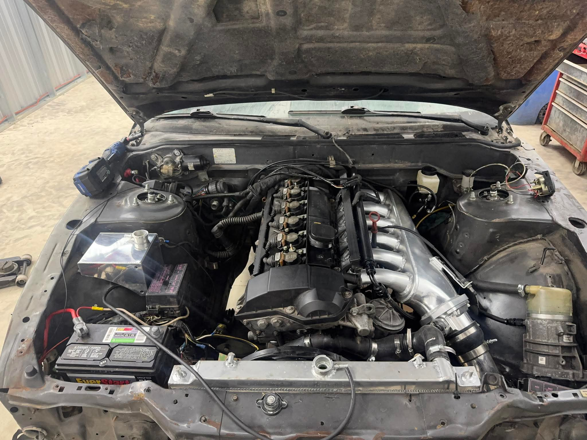
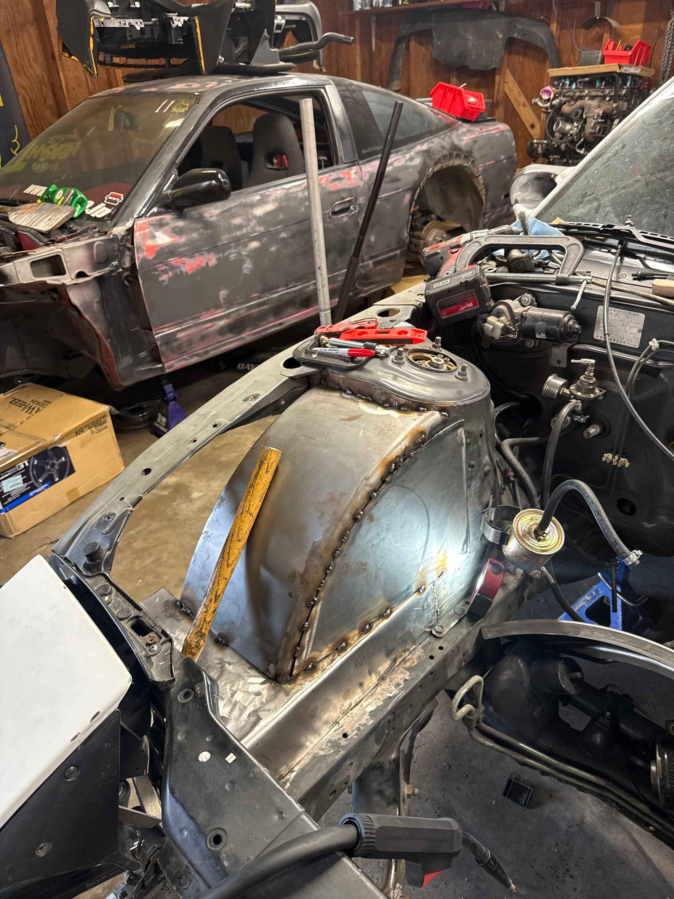
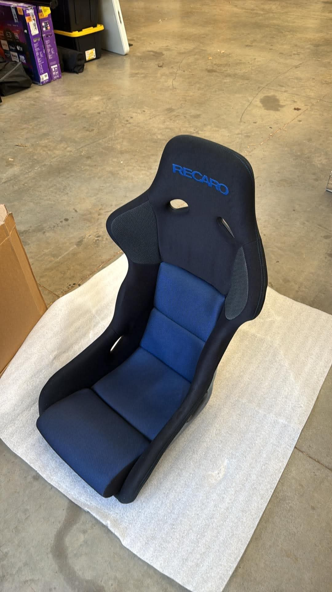
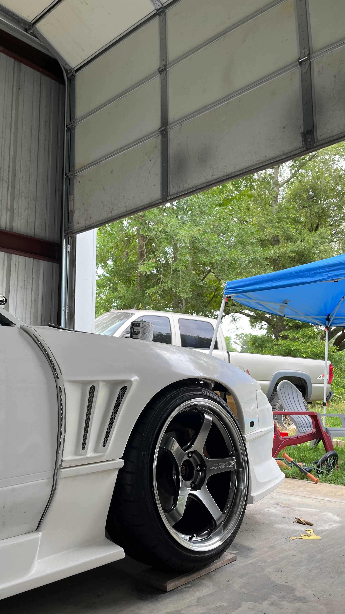
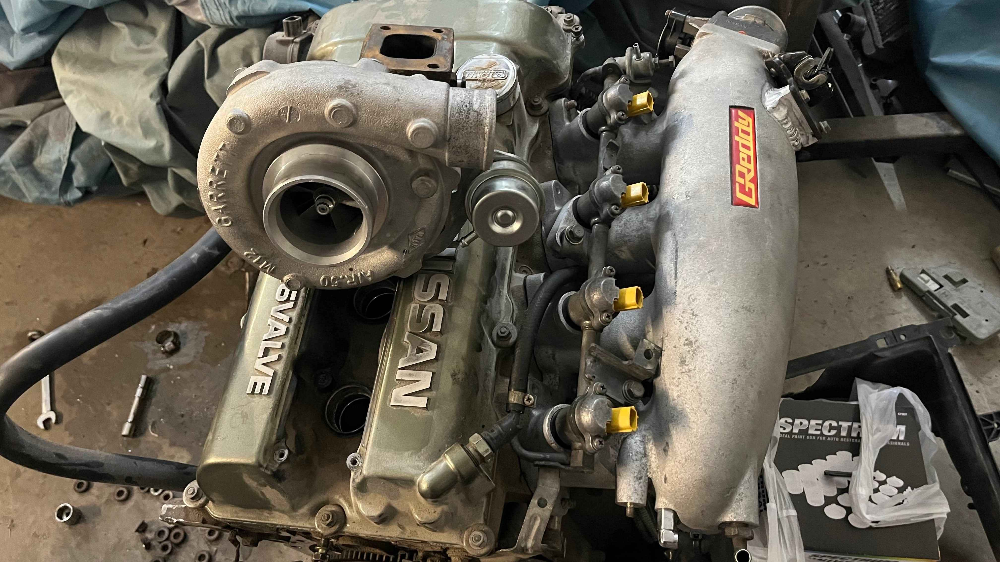

 *Things change, friends leave, and life doesn't wait on anybody...* 

This past year or so has been a pretty slow driving-wise for most of us (except Zach and Colby...), with some big life changes for a lot of us. I moved to Colorado, Zach moved to Houston twice, Hunter got married, Maddox & Pedro graduated and got j*bs, and everyone's cars are down. We're still kickin' though, I think a few of us are hoping to make Double Cup or 2027 Special Stage. Hunter and Zach both have big refreshes in the works. Believe me, Hunter's car is going to be really really good. Maddox still has some things to tidy up, Nathan got a bigger turbo, and my cars will never ever run.

In light of my cars not running, I figured I'd actually launch this website. It's been in the works for a while, as I've been seriously dragging ass on working on it (kind of like 240sx). Unfortunately I already wanna remake it to look more y2k, but who gaf. We still have a few driver's profiles to add/update, but we're most of the way there.

Anyways here's a little peek at what's in the works for everyone. :)


  
  
  
  
  
  
  
  
