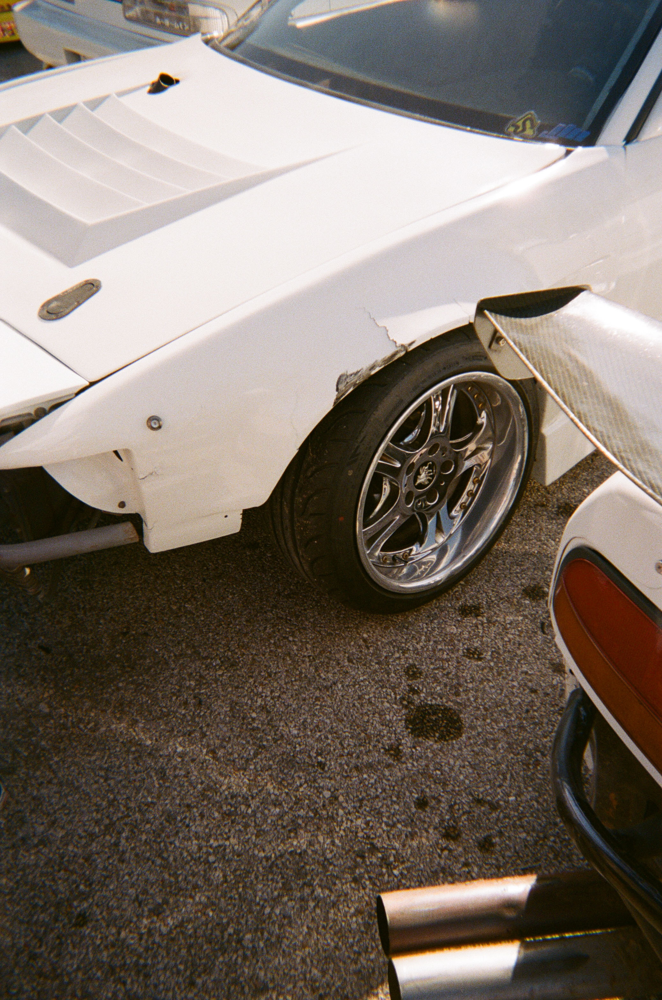
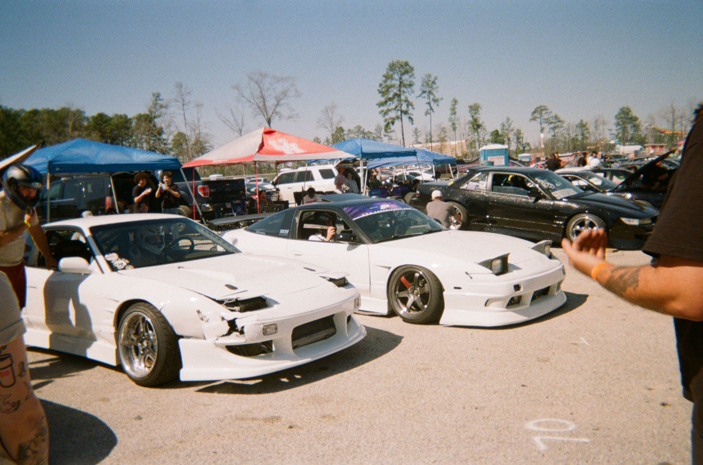
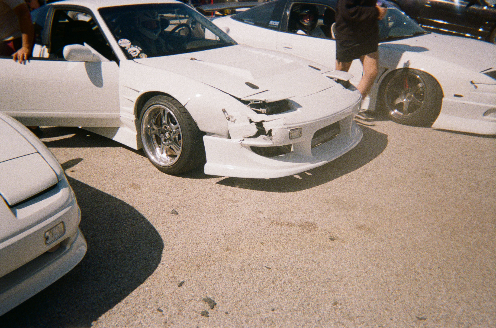
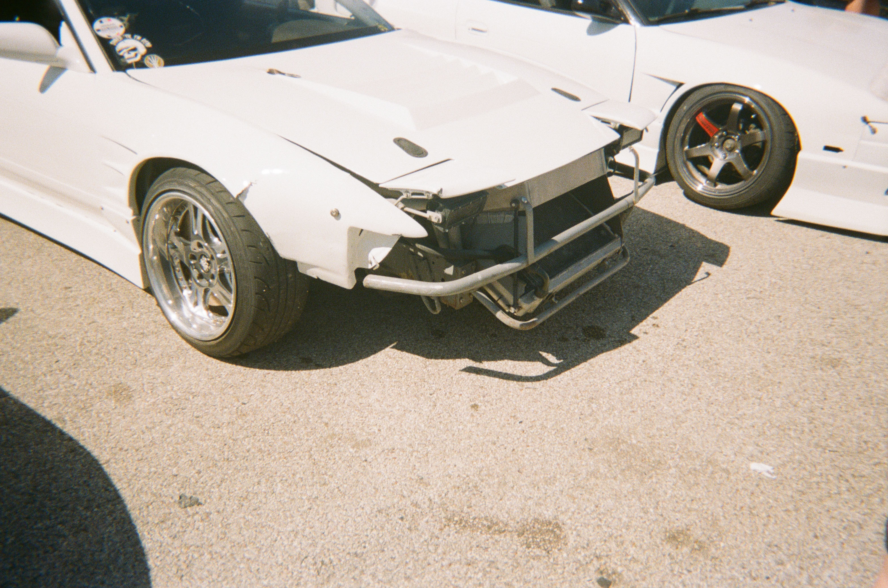
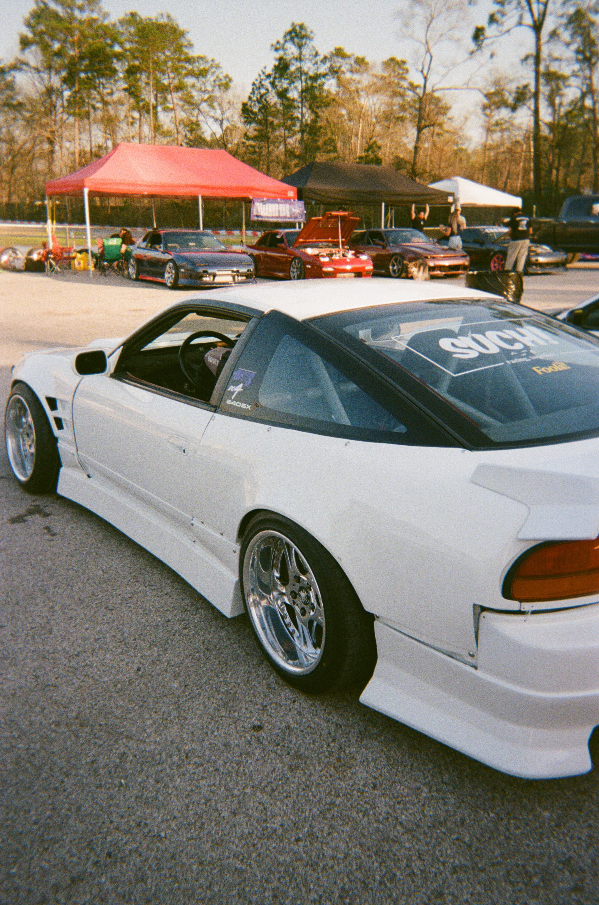
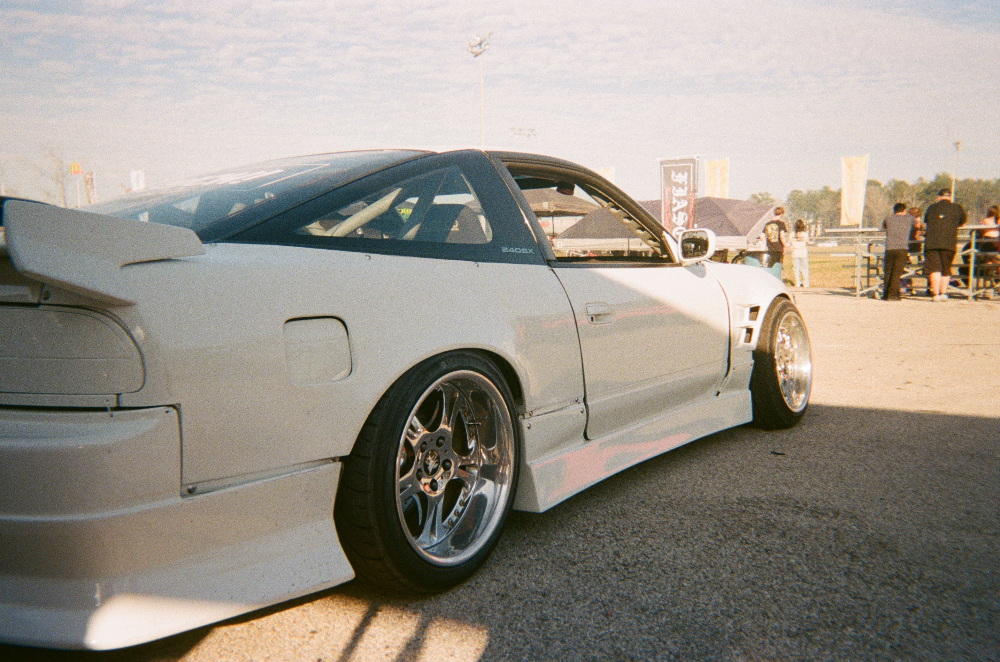
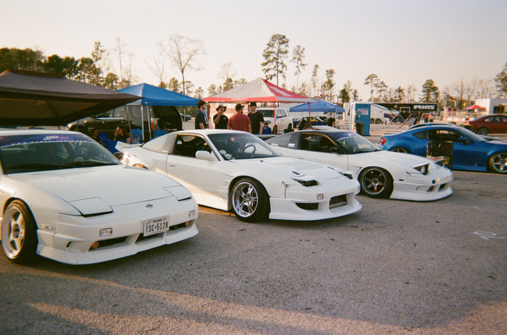

 Bro sure talks a lot of shit for being in pissing distance. 

Hunter plays his part well in keeping the spirit of exciting grassroots motorsports alive. He's always got a smile on his face and is great to have around. He's a cool driver and an even cooler dude, if you can get over the fact that he thinks JZs belong in s-chassis. 


## *Machine Check*
**1989 Nissan 240sx Hatch**

**Engine:** Unopened 1jz-gte vvti, stock turbo, Tial wastegate, V-mount intercooler/radiator, tuned on a Link Monsoon4x.

**Drivetrain:** R154 with a spec clutch, welded 3.9 diff, Corsatec z33 axle conversion.

**Footwork:** BC Racing coilovers, ISR Pro tension rods, 30mm extended lower control arms, Corsatec cut knuckles, Parts Shop Max Limit Break rear knuckles and arms, Parts Shop Max z32 front and rear brakes with dual rear calipers, solid subframe bushings.

**Aero:** Carmodify Wonder Glare full kit with 50mm front and rear GT fenders.

**Wheels:** Weds Cerberus 1
- **F** - 17x9.5+5 245/40
- **R** - 17x10.5+0 255/45

**Interior:** S14 dash, Sparco circuit 2 driver seat, Sparco sprint passenger seat, Racetech dash.


  
  
  
  
  
  
  
