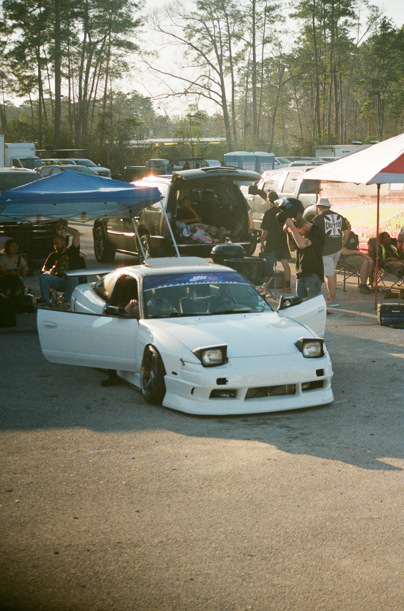
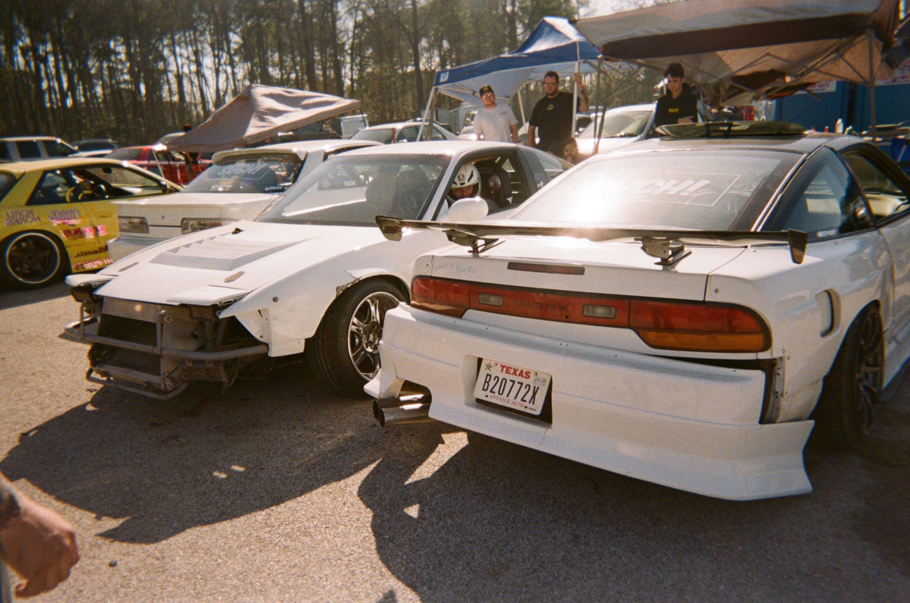
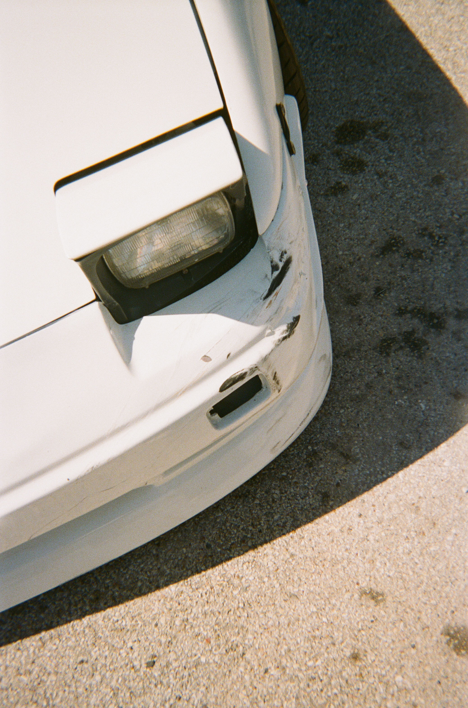
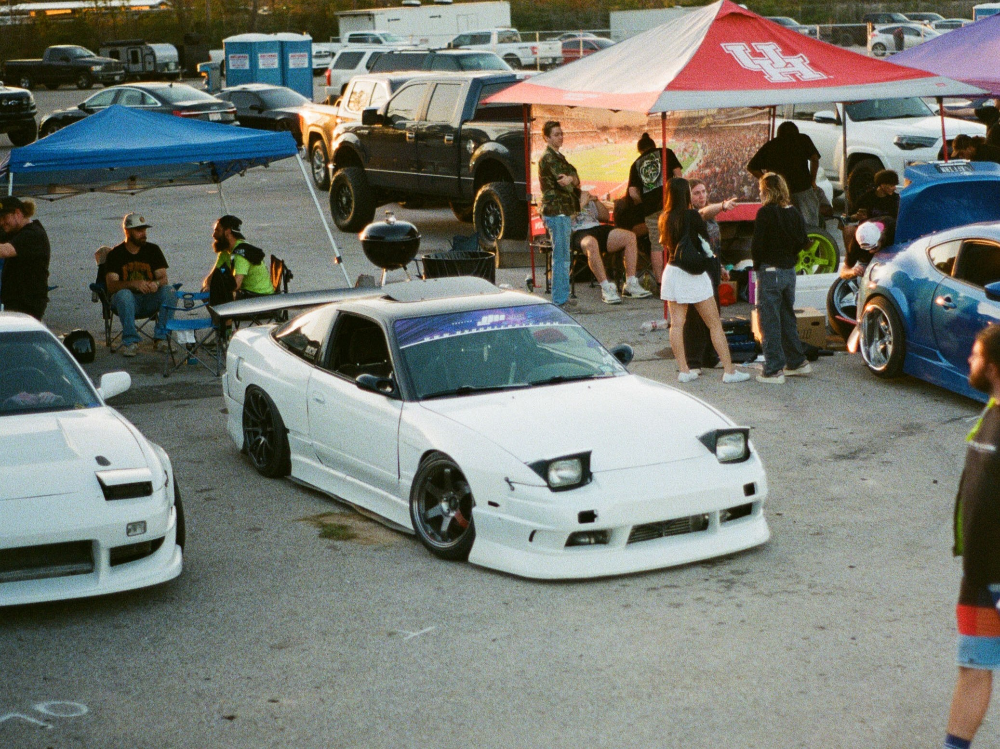
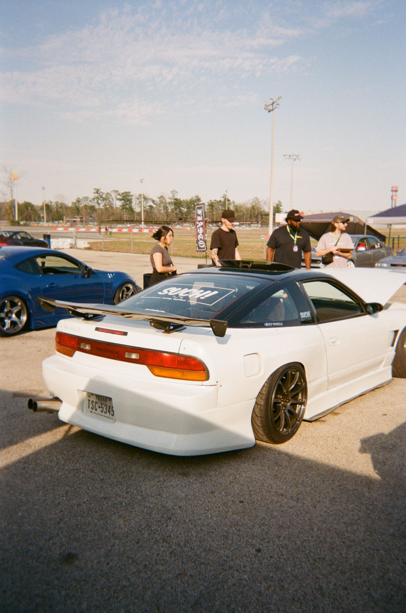
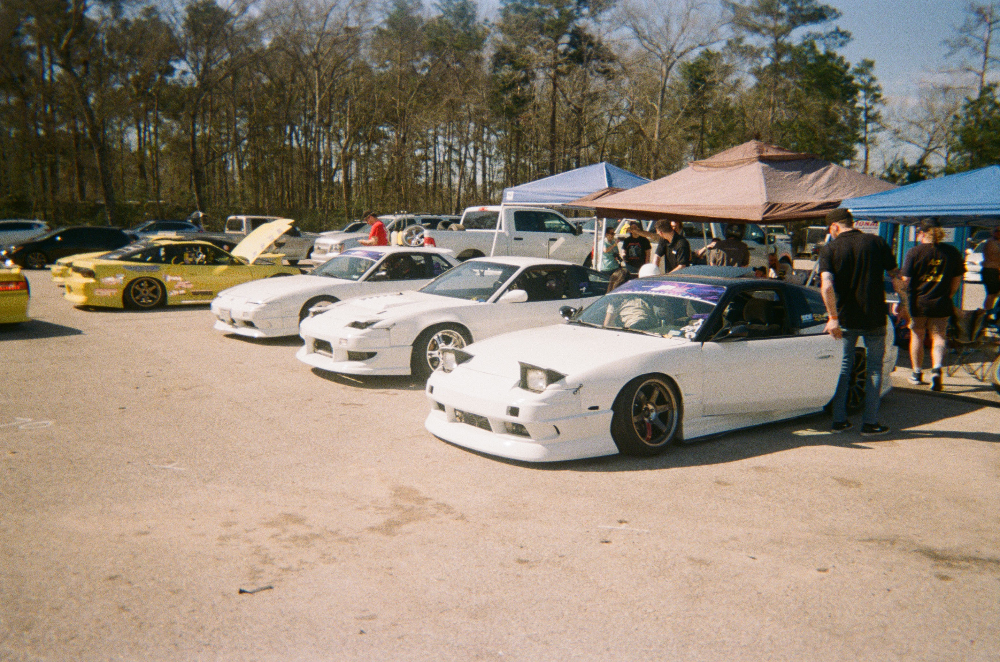

 Husband and Father, it's always a treat when Nathan finds the time to drive with us. 

### How did you get into cars? How did you get into drifting?

Honestly, I couldn’t say what exactly got me into cars. I feel like I’ve liked cars ever since I had the ability to make memories. Whether it was watching nascar with my grandpa, going to races and car shows with my dad, or any of the media on tv at the time.

What got me into drifting? That’s a tough one too. Fast and furious was probably my introduction to it, or initial d. I remember sitting up in my room reading old magazines dreaming of the day I could have a car like that, or drive like they do. I think my trips to Montana driving with my friend Andrew in his fc rx7 were a major accelerant to starting actually driving, too. One day I saw there was a small local drift event for cheap at a circle track, so I loaded my Miata up full of junkyard spares and tried it out for the first time. I’ve been hooked ever since.

### What influenced your driving style? Any drivers in particular?

I’ve always loved street style. Wish I had one particular influence to point to. I mean everyone wants to drive like Naoki, right? I suppose team based drifting and tandem street videos have had the greatest impact on me and my current style.

### What influenced your car’s style? Any cars in particular?

Animal Style, Villains, and Faction definitely. 
Pretty similar answer as above - street style. Low, loud, fast.



## *Machine Check*

**Engine:** Fully stock unopened black top SR20 with tubular equal length manifold, HPI downpipe, modified HKS exhaust, front mount intercooler, and an HKS gen1 boost controller.

**Drivetrain:** Fully stock. Thanks Nissan for making the greatest drivetrain of all time. Stock SR 5 speed, 4.1 welded diff.

**Footwork:** BC Racing DS coilovers, GK Tech knuckle adapter, Maxima tie rods, GK Tech tension rods and power brace, 30mm extended flca, GK Tech full rear suspension catalog. Stock knuckles and brakes front and rear.

**Aero:** BN Sports type 2 style kit, Origin Lab 20mm single vent front fenders, Origin Lab 55mm over fender, Sard Fuji Spec M GT Wing.

**Wheels:**
- **F** - Volk TE37SL 17x9+22 215/45
- **R** - Advan RS2 18x10+20 235/40, 30mm spacer

**Interior:** Pretty much stock. S14 seats, Uras steering wheel, Likewise shifter, custom e-brake handle, Blitz black light boost gauge, HKS boost controller.


  
  
  
  
  
  
