 Always the heart of the party. 

### How did you get into cars? How did you get into drifting?

I grew up in a household that focused more on cars than anything like sports or hobbies, my dad always had a few cars to flip and a rock crawler or two in the garage. I watched him spend 4 summers balancing work, 2 kids and doing a frame off rebuild of a 86 Suzuki samurai. I loved being around cars and the community it brought but ended up leaning more into “cars” and not trucks. Then the video games got to me, I think it was GRID? But I got addicted to drifting and it’s been all downhill from there. 

### What influenced your driving style? Any drivers in particular?

I never watched tons of drifting videos but I do watch the Ryan Tuerck off seasons 2 video over and over along with some of the early blood masters videos. I liked the idea of pushing the cars to the limit regardless of the consequences. Oh! And Stewy Bryant! Even though I came across him much later in life. 

### What influenced your car’s style? Any cars in particular?

I’m a huge fan of the simple OE+ look, WolfPackYuma’s car was always a template of what I wanted to create, a simple, SR, oe plus car that could still be enjoyed on the weekend and the track alike.



## *Machine Check*

**Engine:** Quick rundown - red top SR, PBM cobra downpipe and mid mount intercooler, I have a s15 bbt28! Club t28! 
Internal wise my engine is bone stock, I’ve pulled it down and done rings and bearings across the board but didn’t swap any major components. I run an external wastgate as of 2025 and I’m enjoying that, it gives the car a more raw feeling. Z32 maf and a RSempathy tune. And the piece de la resistance, TAARKS power steering bracket, order it now and thank me later. Super mellow, simple car. 

**Drivetrain:** I have a stock SR transmission in my car, I actually just blew up my first one this year! Hopefully this one lasts the 4 years the old one did! I wish I had any idea what clutch is in the car, it was used when I pulled the engine out of the donor car and it’s still kicking, something from Japan? I run a stock final drive currently, 4.10? Combined with a s15 helical LSD that I hyperfixated on reshimming a few years back, and it locks well, like really well. And not as noisy as my old KAAZ.

**Footwork:** Currently I have a set of B knuckle v1s on my car, they’ve been handed down and handed down again, no idea who had them before but I found them at a parts sale in Colorado. They’ve treated me super well, I’m considering a swap to b knuckle v3s as I push my driving more, but they don’t bind, they have tons of feel and tons of angle. Z32 brakes up front, stock brakes in the rear with Project Mu pads, and only camber arms in the rear. My goal with this car was to keep it as simple as possible and drive it as hard as possible.

**Aero:** I always wanted a type X coupe, so I got my hands on an OEM type x bumper, spats, brackets, and lights a few years back along with dorki dori side skirts and rear spats! I had an OEM type x lip that a really good friend sent me, but the years haven’t been kind and it’s on its last legs sadly. I’m looking at going to a fiberglass replacement! I have origin trunk and roof wings and my favorite part! My clear tails!

**Wheels:** I run a few wheels these days, I like to run my Desmond regamasters (17x9+17) up front with a 215/45/17 kenda, but I also dabble in some 17x9+22 kiwis or 57drs! I generally run a 215-235 rear tire depending on what track and how badly I want to break something and cut my weekend short. 

**Interior:** Interior is a huge focal point of the coupe, I’ve torn it entirely out and re done from the ground up, the carpet has been replaced, I run stock z33 seats adapted to fit s13, I have a Grip Royal wheel with a G-Corp horn button! My shift knob is an old old old Nismo shift knob that I’ve been told came from special edition r31s? Maybe someone can shed some light on it for me. I only have AEM gauges, as with how often I use this car for just regular transport, I value knowledge over form. And I do have a sinful new double din radio with CarPlay, but hey, it’s got a sub so like, that makes up for it?


  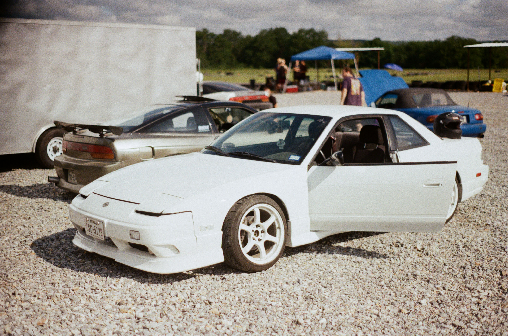
  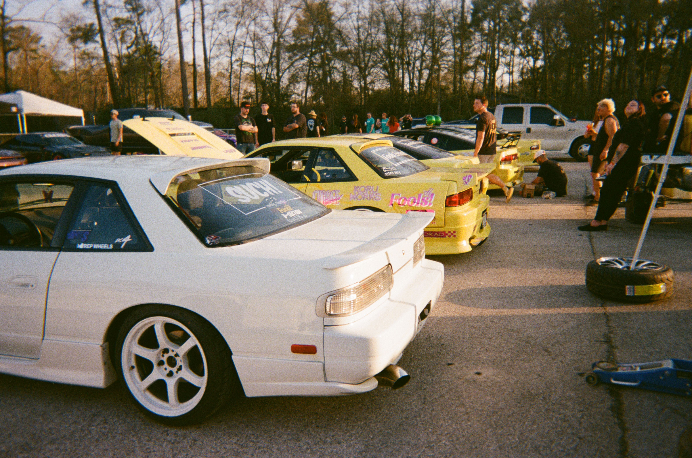
  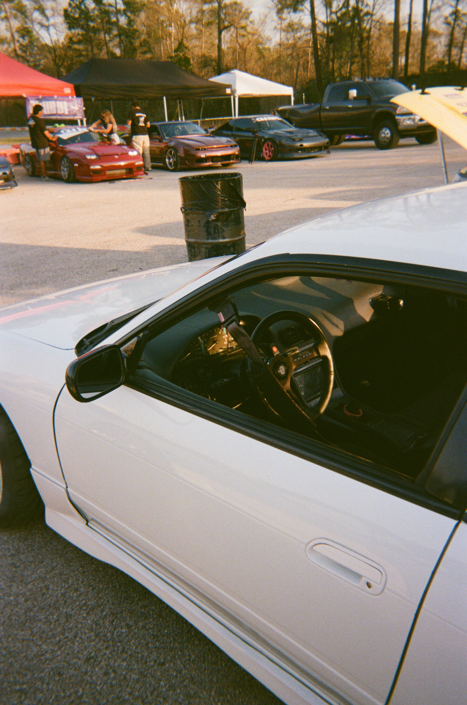
  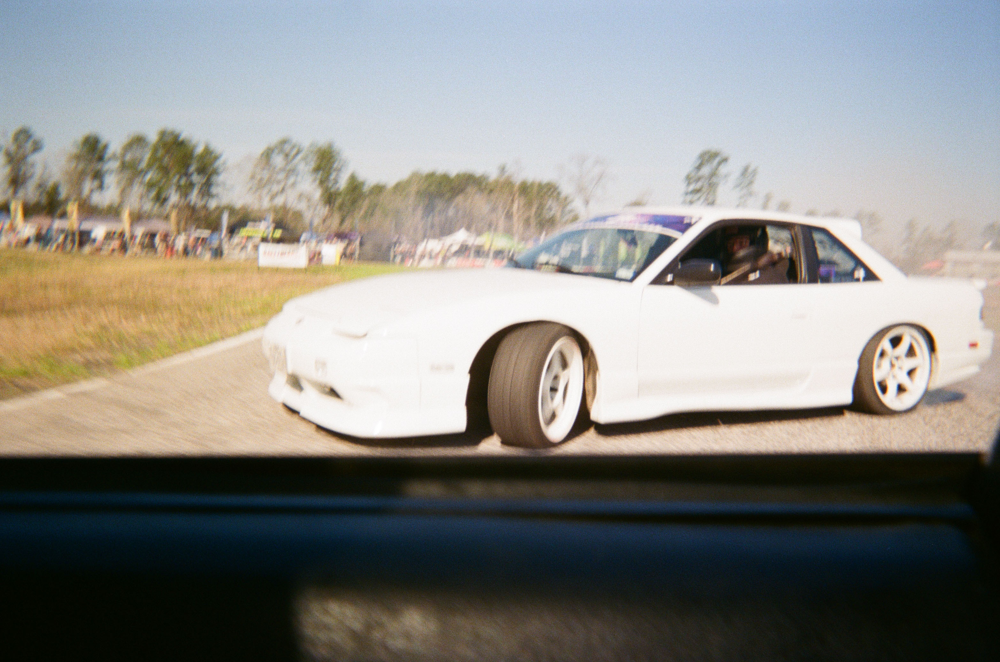
  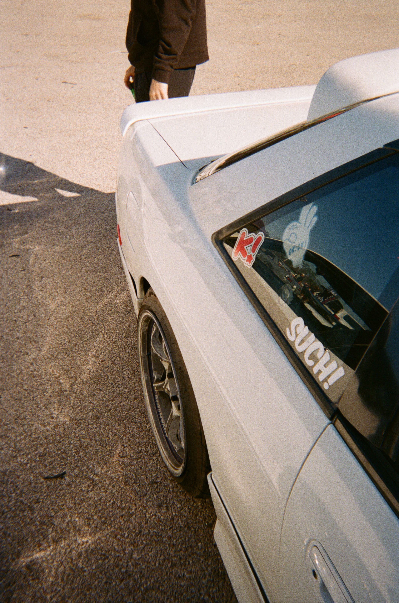
  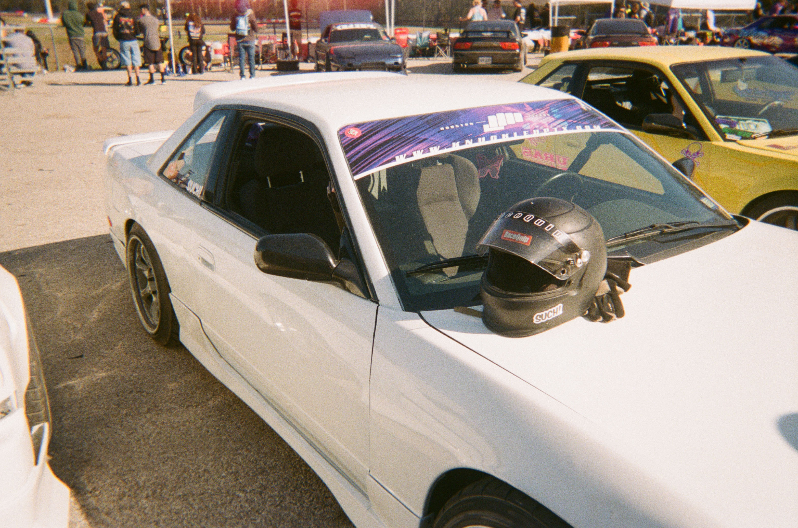
  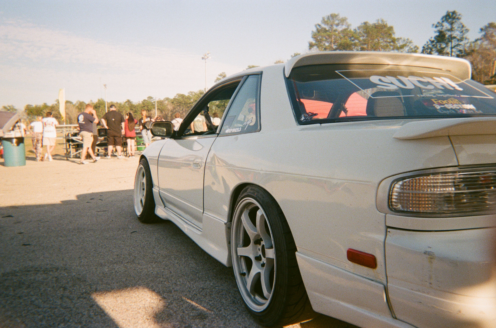
  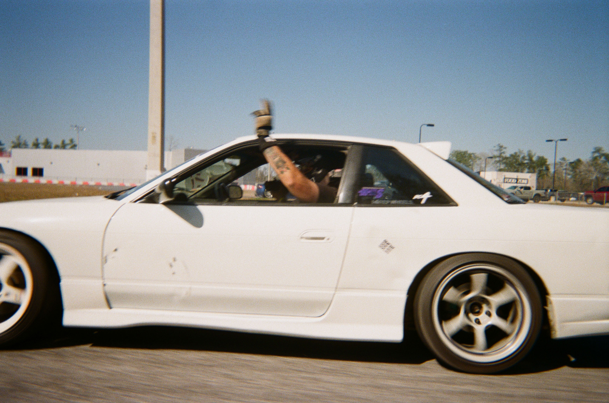
  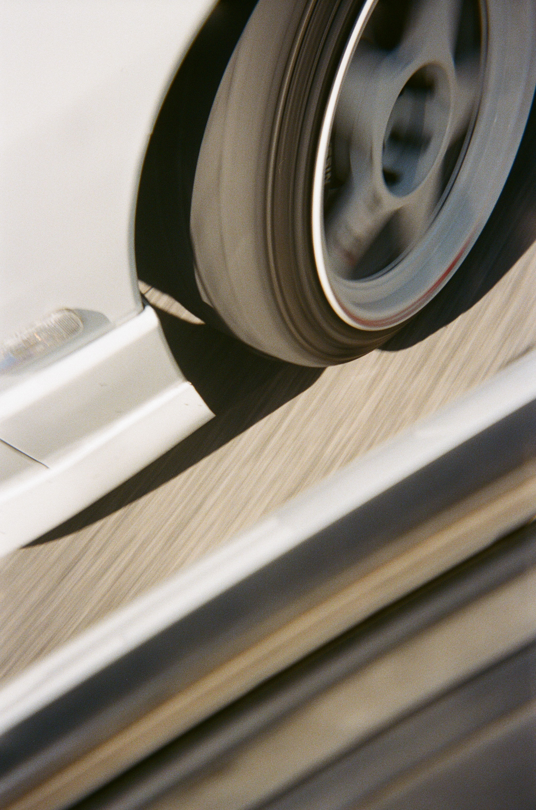
  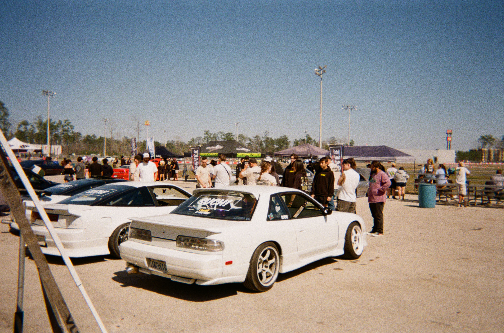
  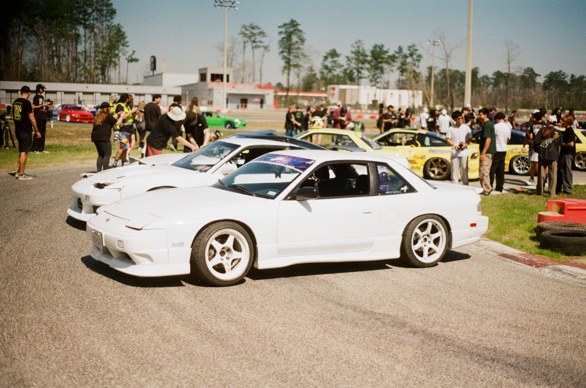
  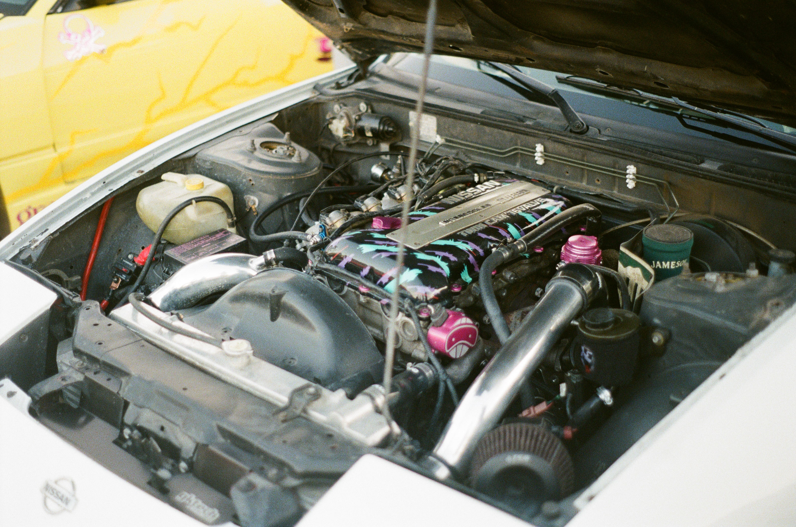
